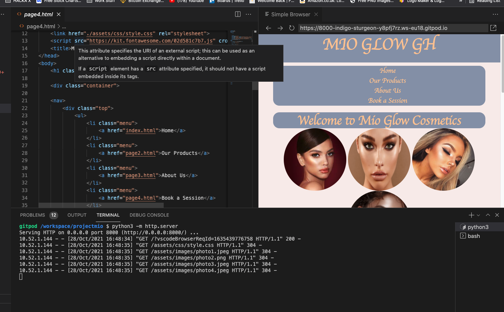

# ProjectMio

Projectmio is a project built primarily to highlight and bring value to the fashion industry, worth billions. It is a simple four page website that lists multiple products and packages that can be purchased.
ProjectMio is a fashion website primarily designed ot make it easy to book makeup sessions at the click of a button. 


## User Experience

### Goals

### User Goals
- As a user, I want to be able to easily navigate to the product offered.
- As a user, I want to see a nice looking and responsive site.
- As a user, I want to able to make sense of the website.

### Owner Goals
- As the owner, I want my site to be easily used.
- As the owner, I want as the site's pupose to be easily understood.
- As the owner, I want the user to be able to navigate without issues.

### User Stories

* The purpose of this site is to draw the attention of new customers to purchase makeup packages offered by Mio Glow.
* It starts off with for main navigation items deliberately vertically stacked for aestethic purposes.
* Mio Glow has a high rating on Google


## Design

### Colour scheme

I went with light and feminine orented colours to evoke a sense of welcome, these colours are well established in regards to the fashion industry, with an emphasis on colours similar or derived from shades of pink, and also included colours that complement pink.

| Color             | rgb                                                                |
| ----------------- | ------------------------------------------------------------------ |
| white, pink | rgb(248, 237, 235) |
| Alice Blue | rgb(240,248,255) |
| cream, orange| rgb(254, 200, 154)|
| Black |rgb(0, 0, 0)  |
| Black,dark red |rgb(20, 19, 19)  |
| Blue,silver |rgb(142, 154, 175)  |


## Font

The two main fonts used were cursive and monospace. Cursive and monospance work well hand in hand to achieve a style that best fits the fashion industry, with writing that looks welcoming to the user.

## Features

- changes depending on the size of the screen
- photos and buttons dynamically expand and contract as well as change shape when hovered on with a mouse.
- aesthetically pleasing.
- cross platform

## Languages used

Html and Css
## Technologies Used

- ### Html
- ### CSS

## Libraries/Frameworks used

- Bootstrap : this helped me to create a mobile first oriented webpage

## Programs used

- Git : Allowed me to push my changes to the repository

- Github : Stores my repository

- Gitpod : the editor where I write my code.

## Testing

### Validators 
- The two validators used were W3C Markup validator and W3C CSS validator


### W3C Markup validator
- No errors were detected

### W3C CSS validator
- No errors were detected

## Testing against my user goals
### As a user, I want to be able to easily navigate to the product offered.
- Clear and easy to find navigation bar that allows the user to find the 'Book a session page'

### As a user, I want to see a nice looking and responsive site.
- Site is quick and responsive and no major issues were found.

### As a user, I want to able to make sense of the website.
- Clean and easy to understand writing prevents any confusion.

## Testing responsiveness on multiple screen sizes
A program called Responsinator was used in order to make sure that the site was responsive and worked well accross multiple screen sizes. No major issues were found.


## Known Bugs

There are currently no bugs that have been identified

## Deployment

* log in to Github
* In the settings of the repository, scroll down to github pages
* click on "master" as your source
* a link will be generated, taking you to the site.
## Run Locally

Clone the project

```bash
  click on the gitpod button generated from the gitpod extension
```


Go to terminal


Start the server

```bash
  python3 -m http.server
```


Click on open preview/open browser

```bash
  python3 -m http.server
```


## Support

For support, email nanaohagan@gmail.com or join our code institute Slack channel.


## Contributing

Contributions are very welcome!


## Authors

- [N.Y Hagan](https://github.com/NyHagan/projectmio)


## About Me
I'm a full stack developer in training...


## 🔗 Links
https://github.com/NyHagan

## Roadmap

- Additional browser support

- Add more integrations


## Media

All media was grabbed from Google


## Acknowledgements

 - [Code Insitute](https://codeinstitute.net)
 - [Learning People]( https://www.learningpeople.com/uk/)
 - [Team Mio](https://www.instagram.com/itsqueenda/?hl=en)


